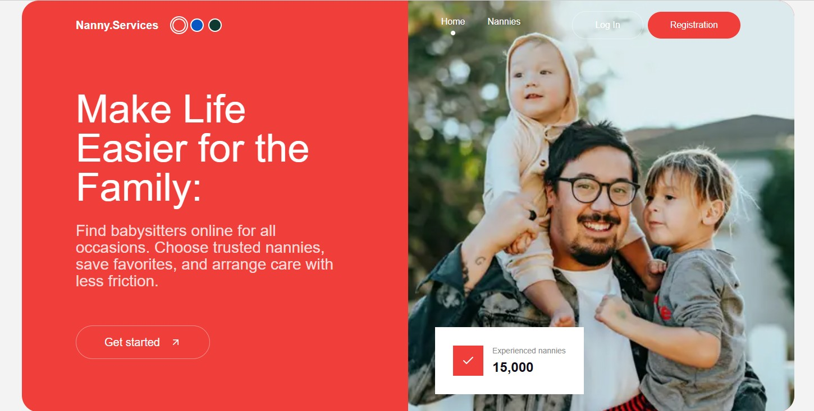
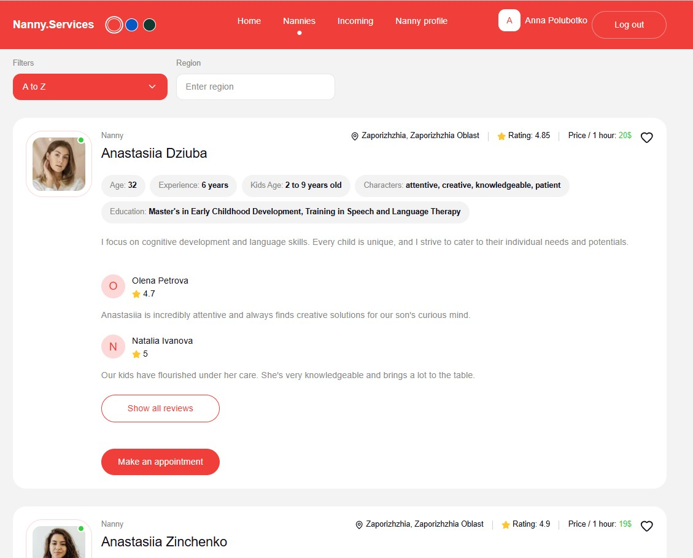
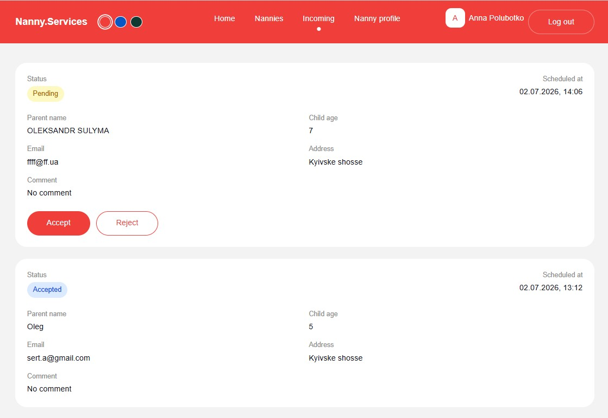
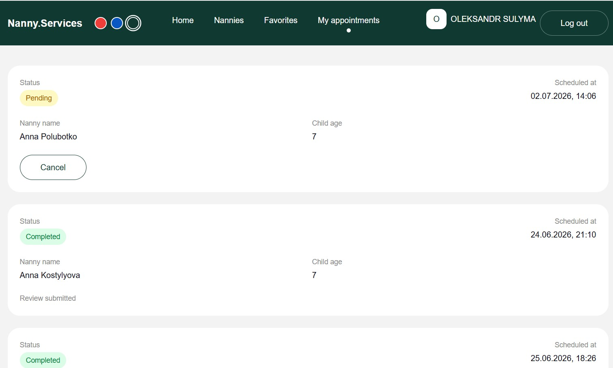
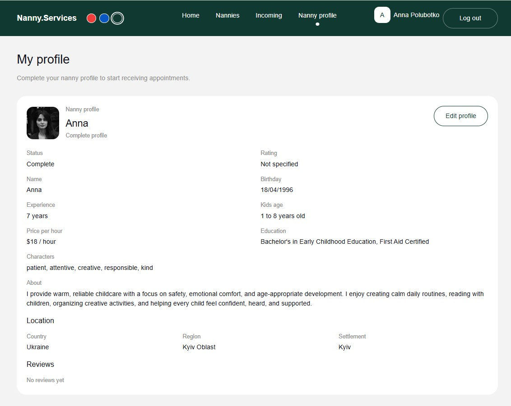
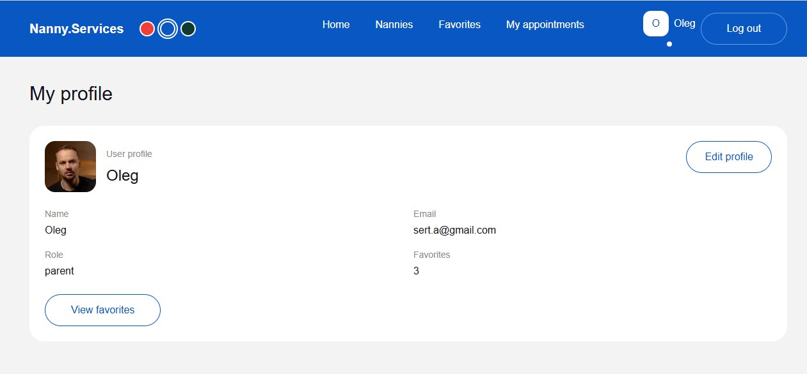

# Nanny Services

Fullstack platform for finding, booking, and managing nanny services.

The project is organized as a monorepo with a Next.js frontend and an Express
backend. Parents can browse nanny profiles, manage favorites, create
appointments, complete meetings, and leave reviews. Nannies can maintain their
profiles, manage incoming appointment requests, and view parent feedback.

## Live Demo

- Frontend: [nanny-services-fullstack.vercel.app](https://nanny-services-fullstack.vercel.app/)
- Backend API: [nanny-services-api.onrender.com](https://nanny-services-api.onrender.com/api/nannies)
- API Docs: [Scalar API Reference](https://nanny-services-api.onrender.com/api-docs)
- Repository: [nanny-services-fullstack](https://github.com/Oleksandr-Sulyma/nanny-services-fullstack)

## Preview








## Features

- Registration, login, logout, and JWT cookie authentication
- Parent and nanny roles
- Protected routes by role
- Public nanny catalog with pagination, sorting, and region filtering
- Favorites stored in MongoDB and synchronized after login
- Parent profile editing with avatar upload
- Nanny profile editing with profile completion status
- Cloudinary avatar uploads
- Appointment booking from nanny cards
- Incoming appointment management for nannies
- Parent appointment management
- Appointment statuses: pending, accepted, rejected, completed, cancelled
- Reviews for completed appointments
- Automatic nanny rating recalculation
- Reviews visible in nanny profile and completed incoming appointments
- Theme switcher with red, blue, and green themes
- Toast notifications for success and server/network errors
- Modal dialogs for auth, appointments, confirmations, and reviews
- Responsive layouts for desktop, tablet, and mobile

## Tech Stack

### Frontend

- Next.js 16 with App Router
- React 19
- TypeScript
- Tailwind CSS 4
- Zustand
- React Hook Form
- Zod
- Radix Dialog
- Lucide React
- Vercel

### Backend

- Node.js
- Express 5
- MongoDB Atlas
- Mongoose
- JWT
- bcrypt
- Celebrate and Joi
- Multer
- Cloudinary
- Vitest, Supertest, and mongodb-memory-server
- Render

## Project Structure

```text
nanny-services-fullstack/
  backend/
    config/
    controllers/
    db/
    middleware/
    models/
    routes/
    services/
    tests/
    validations/
    app.js
    index.js
  frontend/
    app/
    components/
    lib/
    public/
    store/
    types/
  docs/
    API.md
  tools/
    dev.mjs
  package.json
```

## Getting Started

### 1. Clone the repository

```bash
git clone https://github.com/Oleksandr-Sulyma/nanny-services-fullstack.git
cd nanny-services-fullstack
```

### 2. Install dependencies

Install frontend and backend dependencies from the repository root:

```bash
npm run install-all
```

Or install them manually:

```bash
npm install --prefix backend
npm install --prefix frontend
```

### 3. Configure environment variables

Create `backend/.env` based on `backend/.env.example`:

```env
PORT=5000
MONGO_URL=mongodb+srv://...
JWT_SECRET=your-secret
NODE_ENV=development
JWT_EXPIRES_IN=1h
CLOUDINARY_CLOUD_NAME=your-cloud-name
CLOUDINARY_API_KEY=your-api-key
CLOUDINARY_API_SECRET=your-api-secret
```

Create `frontend/.env.local`:

```env
API_URL=http://localhost:5000/api
```

For the deployed backend, use:

```env
API_URL=https://nanny-services-api.onrender.com/api
```

### 4. Run the app

Run frontend and backend together from the repository root:

```bash
npm run dev
```

Or run them separately:

```bash
npm run dev-backend
npm run dev-frontend
```

Default local URLs:

- Frontend: [http://localhost:3000](http://localhost:3000)
- Backend: [http://localhost:5000](http://localhost:5000)
- API docs: [http://localhost:5000/api-docs](http://localhost:5000/api-docs)

## Available Scripts

### Root

| Script | Description |
| --- | --- |
| `npm run dev` | Run frontend and backend together |
| `npm run dev-frontend` | Run the frontend development server |
| `npm run dev-backend` | Run the backend development server |
| `npm run install-all` | Install backend and frontend dependencies |
| `npm run lint` | Run frontend ESLint |
| `npm run build` | Build the frontend for production |
| `npm test` | Run backend tests |

### Frontend

| Script | Description |
| --- | --- |
| `npm run dev` | Start the Next.js development server |
| `npm run build` | Build the frontend for production |
| `npm start` | Start the production frontend server |
| `npm run lint` | Run ESLint |

### Backend

| Script | Description |
| --- | --- |
| `npm run dev` | Start backend with Nodemon |
| `npm start` | Start backend with Node.js |
| `npm test` | Run Vitest test suite |
| `npm run test:watch` | Run Vitest in watch mode |

## Environment Variables

### Frontend

| Variable | Description |
| --- | --- |
| `API_URL` | Backend API base URL used by Next.js route handlers |

### Backend

| Variable | Description |
| --- | --- |
| `PORT` | Backend server port |
| `MONGO_URL` | MongoDB connection string |
| `JWT_SECRET` | Secret used to sign JWT tokens |
| `JWT_EXPIRES_IN` | JWT lifetime |
| `NODE_ENV` | Runtime environment |
| `CLOUDINARY_CLOUD_NAME` | Cloudinary cloud name |
| `CLOUDINARY_API_KEY` | Cloudinary API key |
| `CLOUDINARY_API_SECRET` | Cloudinary API secret |

## Application Routes

| Route | Description |
| --- | --- |
| `/` | Home page |
| `/nannies` | Public nanny catalog |
| `/favorites` | Parent favorites |
| `/appointments` | Parent appointments |
| `/appointments/incoming` | Nanny incoming appointments |
| `/profile` | User profile |
| `/nanny/profile` | Nanny profile |
| `/register` | Registration page fallback |

## API Overview

REST API routes, authorization rules, query parameters, and sample request
bodies are documented in [docs/API.md](docs/API.md).

Interactive Scalar API documentation is available while the backend is running:

```text
http://localhost:5000/api-docs
```

### Authentication

| Method | Endpoint | Description |
| --- | --- | --- |
| `POST` | `/api/auth/register` | Register a parent or nanny |
| `POST` | `/api/auth/login` | Log in and receive an auth cookie |
| `POST` | `/api/auth/logout` | Log out and clear auth state |

### Users

| Method | Endpoint | Description |
| --- | --- | --- |
| `GET` | `/api/users/me` | Get current user |
| `PATCH` | `/api/users/avatar` | Update avatar URL |
| `PATCH` | `/api/users/profile` | Update name, email, or avatar |
| `PATCH` | `/api/users/update-password` | Update password |
| `POST` | `/api/users/favorites` | Toggle nanny favorite |

### Nannies

| Method | Endpoint | Description |
| --- | --- | --- |
| `GET` | `/api/nannies` | Get completed nanny profiles |
| `GET` | `/api/nannies/:nannyId` | Get nanny details and reviews |
| `GET` | `/api/nannies/me` | Get current nanny profile |
| `PATCH` | `/api/nannies/me` | Update current nanny profile |
| `POST` | `/api/nannies/:nannyId/appointments` | Create appointment request |

### Appointments

| Method | Endpoint | Description |
| --- | --- | --- |
| `GET` | `/api/appointments/my` | Get parent appointments |
| `GET` | `/api/appointments/incoming` | Get nanny incoming appointments |
| `PATCH` | `/api/appointments/:appointmentId/status` | Accept or reject appointment |
| `PATCH` | `/api/appointments/:appointmentId/complete` | Complete accepted appointment |
| `PATCH` | `/api/appointments/:appointmentId/cancel` | Cancel pending or accepted appointment |
| `POST` | `/api/appointments/:appointmentId/reviews` | Review completed appointment |

### Uploads

| Method | Endpoint | Description |
| --- | --- | --- |
| `POST` | `/api/uploads/avatar` | Upload avatar image to Cloudinary |

## Core Flows

### Parent Flow

1. Register or log in as a parent.
2. Browse and filter nanny profiles.
3. Add nannies to favorites.
4. Open a nanny card and create an appointment request.
5. Track appointment status on the appointments page.
6. Complete accepted appointments.
7. Leave a review after completion.

### Nanny Flow

1. Register or log in as a nanny.
2. Complete the nanny profile.
3. Receive appointment requests from parents.
4. Accept or reject pending requests.
5. View completed appointment feedback and profile reviews.

## Data Models

### User

```js
{
  name: String,
  email: String,
  passwordHash: String,
  avatar: String,
  role: "parent" | "nanny",
  favorites: [ObjectId]
}
```

### Nanny

```js
{
  userId: ObjectId,
  name: String,
  avatar_url: String,
  birthday: Date,
  experience: String,
  education: String,
  kids_age: String,
  price_per_hour: Number,
  location: {
    country: String,
    region: String,
    settlement: String
  },
  about: String,
  characters: [String],
  rating: Number,
  isProfileComplete: Boolean
}
```

### Appointment

```js
{
  parentId: ObjectId,
  nannyId: ObjectId,
  parentName: String,
  email: String,
  address: String,
  phone: String,
  childAge: String,
  scheduledAt: Date,
  comment: String,
  status: "pending" | "accepted" | "rejected" | "completed" | "cancelled"
}
```

### Review

```js
{
  authorId: ObjectId,
  nannyId: ObjectId,
  appointmentId: ObjectId,
  rating: Number,
  comment: String
}
```

## MongoDB Indexes

The database uses these unique indexes:

```text
users.email
nannies.userId
reviews.appointmentId
```

The `reviews.appointmentId` index is partial so imported seed reviews without
an appointment reference remain valid.

## Architecture Notes

- The frontend uses Next.js route handlers as a BFF layer for the backend API.
- Authentication is stored in an HTTP-only cookie.
- Zustand stores client-side auth, favorites, theme, and catalog state.
- Role-based UI is derived from the authenticated user.
- Nanny cards load reviews lazily when expanded.
- Appointment cards are sorted by actionable status first.
- Completed parent appointments unlock the review form.
- Backend request validation is handled with Celebrate/Joi.
- Avatar files are uploaded through the backend to Cloudinary.
- The backend synchronizes nanny display name and avatar from the user profile.
- The backend recalculates nanny average rating after each review.
- Toast notifications are used for server/network errors and success messages.
- Remote avatars are configured through `next.config.ts`.

## Quality Checks

Before pushing a release-sized change, run:

```bash
cd backend
npm test
```

```bash
cd frontend
npm run lint
npm run build
```

Or from the repository root:

```bash
npm test
npm run lint
npm run build
```

The integration tests use an isolated in-memory MongoDB instance. They do not
modify MongoDB Atlas data.

Current backend coverage includes 7 test files and 32 tests across auth, users,
uploads, nannies, nanny profile access, appointments, reviews, and health
checks.

## Design

The UI is based on the
[Nanny Services Figma design](https://www.figma.com/design/rfRPvTjaBi3oa80xNtF2i3/Nanny-Sevices--Copy-?node-id=0-1&m=dev).

## Deployment

- Frontend: [nanny-services-fullstack.vercel.app](https://nanny-services-fullstack.vercel.app/)
- Backend API: [nanny-services-api.onrender.com](https://nanny-services-api.onrender.com/api/nannies)
- Interactive API documentation: [Scalar API Reference](https://nanny-services-api.onrender.com/api-docs)
- OpenAPI specification: [openapi.yaml](https://nanny-services-api.onrender.com/openapi.yaml)
- Database: MongoDB Atlas

## Author

Oleksandr Sulyma

- GitHub: [Oleksandr-Sulyma](https://github.com/Oleksandr-Sulyma)
